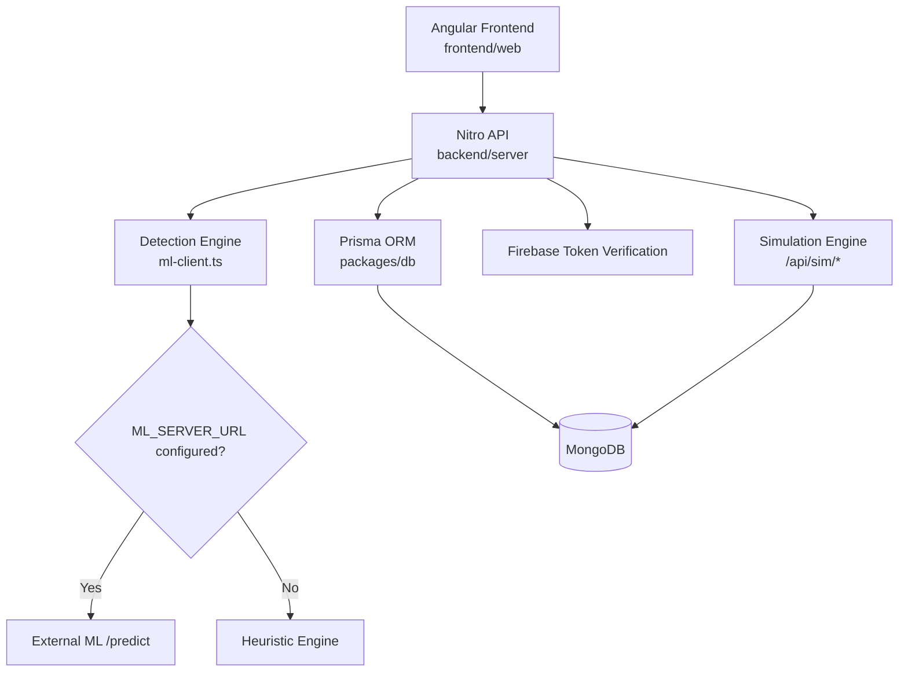

# Aegis Phish Lab

**Human Attack Surface Training Platform**

A production-grade, cloud-native cybersecurity awareness and phishing simulation platform designed for universities, SMEs, and enterprise security teams.

## 🎯 Overview

Aegis Phish Lab is a comprehensive phishing awareness platform that enables organizations to:

- 📧 Create and manage phishing simulation campaigns
- 📊 Track user interactions in real-time
- 📈 Measure security awareness with detailed analytics
- 👥 Manage departments, teams, and individual users
- 🎓 Train employees with realistic phishing scenarios
- 📋 Generate compliance reports and metrics

## 🏗️ Tech Stack

**Frontend:**
- Next.js 15, TypeScript, TailwindCSS
- React Query, Zustand, Framer Motion
- Recharts, shadcn/ui components
- Axios HTTP client

**Backend:**
- Go 1.23, Gin Web Framework
- GORM ORM, PostgreSQL database
- JWT authentication, RBAC
- Clean Architecture pattern

**Database:**
- PostgreSQL 13+ (Supabase compatible)

**Deployment:**
- Docker & Docker Compose
- Vercel (Frontend), Render/Railway (Backend)
- GitHub Actions CI/CD
- CircleCI integration
    "legit": 0.16
  },
  "reasons": [
    {
      "code": "unsafe-http-link",
      "message": "Unsafe HTTP links can expose credentials through insecure transport.",
      "evidence": "http://",
      "weight": 0.2
    },
    {
      "code": "urgency",
      "message": "Urgency language increases pressure on the victim.",
      "evidence": "urgent",
      "weight": 0.08
    }
  ],
  "model": "heuristic-v1",
  "source": "heuristic"
}
```

## System Architecture



## Tech Stack

- Frontend: Angular 19, Tailwind CSS, daisyUI
- Backend: Nitro (h3), Zod
- Database: MongoDB, Prisma
- Auth: Firebase ID token verification + Better Auth package in workspace
- Testing: Vitest
- Monorepo tooling: Turbo, pnpm, Bun runtime support

## Monorepo Structure

```text
aegisPhish-lab/
|-- frontend/
|   |-- web/         # Angular app
|-- backend/
|   |-- server/      # Nitro API
|-- ai/              # AI package surface
|-- packages/
|   |-- auth/        # auth package
|   |-- config/      # shared config
|   |-- db/          # Prisma schema + seed
|   |-- env/         # environment validation
```

## Quick Start

1. Install dependencies

```bash
pnpm install
```

2. Configure backend environment in `backend/server/.env`

Required at minimum:

```bash
MONGODB_URI=...
FIREBASE_PROJECT_ID=...
FIREBASE_CLIENT_EMAIL=...
FIREBASE_PRIVATE_KEY=...
```

Optional (for external model):

```bash
ML_SERVER_URL=http://localhost:8000
```

3. Prepare database

```bash
pnpm db:push
pnpm db:seed
```

4. Run development stack

```bash
pnpm dev
```

Default local URLs:

- Frontend: `http://localhost:3001`
- Backend API: `http://localhost:3000`

## Key Routes

- `GET /demo` - read-only product demo
- `GET /simulator` - interactive phishing walkthrough simulator (authenticated)
- `POST /api/predict` - phishing prediction API (authenticated)
- `GET /api/sim/levels` - simulator levels
- `POST /api/sim/runs` - start simulation run
- `POST /api/sim/runs/:id/actions` - submit action and receive detection + feedback

## Portfolio Positioning

This project is best presented as:

- A phishing readiness platform
- With explainable detection output
- Plus user behavior simulation and measurable risk metrics

If you are using this for interviews, show the simulator flow live and explain how detection reasons map to user coaching decisions.
