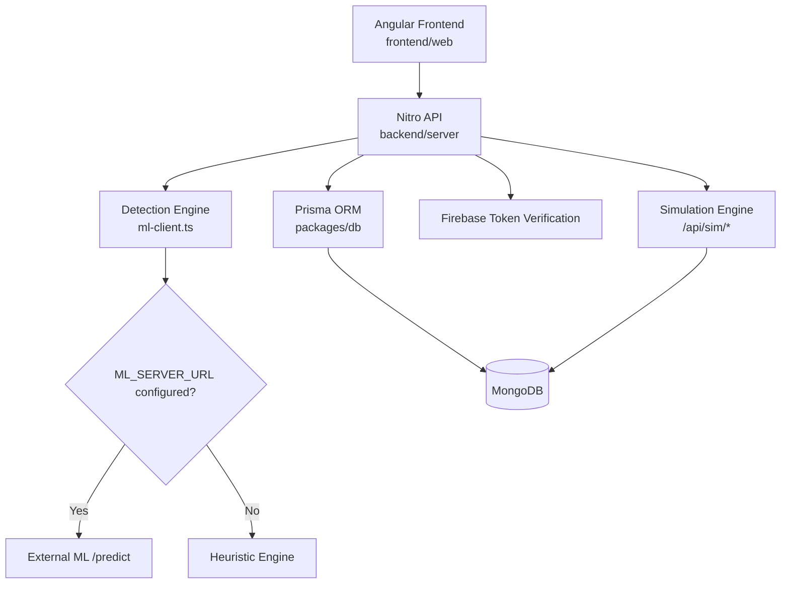

# AegisPhish Lab

AegisPhish Lab is a phishing detection and simulation platform built for security awareness teams and SOC-style workflows.
It combines explainable phishing analysis, realistic phishing simulations, and readiness reporting in one stack.

## Why This Project Matters

Most phishing demos stop at a UI mock. AegisPhish Lab focuses on operational signals:

- Detection output with confidence and explicit reasons
- Scenario-based phishing simulations with scored user actions
- Campaign and user-risk data that can be used for coaching and reporting

## Core Capabilities

- Email/text phishing analysis API (`/api/predict`, `/ai`)
- Explainable detection response:
  - `label` (`phishing` or `legit`)
  - `confidence` and class probabilities
  - ranked `reasons` with evidence snippets
- Phishing walkthrough simulator (`/simulator`):
  - credential reset scam
  - executive wire request scam
  - malicious document-share scam
- Simulation analytics (`/api/sim/analysis`) with scoring and risky-action rates
- Campaign and lab endpoints for training and readiness workflows

## Detection Logic (Explainable)

The current engine uses a hybrid strategy:

1. External ML model (optional)
- If `ML_SERVER_URL` is configured, the backend calls `POST {ML_SERVER_URL}/predict`.

2. Local heuristic fallback (always available)
- If the ML server is unavailable, the platform scores suspicious indicators such as:
  - urgency language (`urgent`, `immediately`)
  - credential prompts (`password`, `login`, `reset`)
  - financial fraud cues (`wire`, `invoice`, `payment`)
  - unsafe links (`http://`)
  - obfuscated links (shorteners like `bit.ly`)

Example prediction payload:

```json
{
  "label": "phishing",
  "confidence": 0.84,
  "probabilities": {
    "phishing": 0.84,
    "legit": 0.16
  },
  "reasons": [
    {
      "code": "unsafe-http-link",
      "message": "Unsafe HTTP links can expose credentials through insecure transport.",
      "evidence": "http://",
      "weight": 0.2
    },
    {
      "code": "urgency",
      "message": "Urgency language increases pressure on the victim.",
      "evidence": "urgent",
      "weight": 0.08
    }
  ],
  "model": "heuristic-v1",
  "source": "heuristic"
}
```

## System Architecture



## Tech Stack

- Frontend: Angular 19, Tailwind CSS, daisyUI
- Backend: Nitro (h3), Zod
- Database: MongoDB, Prisma
- Auth: Firebase ID token verification + Better Auth package in workspace
- Testing: Vitest
- Monorepo tooling: Turbo, pnpm, Bun runtime support

## Monorepo Structure

```text
aegisPhish-lab/
|-- frontend/
|   |-- web/         # Angular app
|-- backend/
|   |-- server/      # Nitro API
|-- ai/              # AI package surface
|-- packages/
|   |-- auth/        # auth package
|   |-- config/      # shared config
|   |-- db/          # Prisma schema + seed
|   |-- env/         # environment validation
```

## Quick Start

1. Install dependencies

```bash
pnpm install
```

2. Configure backend environment in `backend/server/.env`

Required at minimum:

```bash
MONGODB_URI=...
FIREBASE_PROJECT_ID=...
FIREBASE_CLIENT_EMAIL=...
FIREBASE_PRIVATE_KEY=...
```

Optional (for external model):

```bash
ML_SERVER_URL=http://localhost:8000
```

3. Prepare database

```bash
pnpm db:push
pnpm db:seed
```

4. Run development stack

```bash
pnpm dev
```

Default local URLs:

- Frontend: `http://localhost:3001`
- Backend API: `http://localhost:3000`

## Key Routes

- `GET /demo` - read-only product demo
- `GET /simulator` - interactive phishing walkthrough simulator (authenticated)
- `POST /api/predict` - phishing prediction API (authenticated)
- `GET /api/sim/levels` - simulator levels
- `POST /api/sim/runs` - start simulation run
- `POST /api/sim/runs/:id/actions` - submit action and receive detection + feedback

## Portfolio Positioning

This project is best presented as:

- A phishing readiness platform
- With explainable detection output
- Plus user behavior simulation and measurable risk metrics

If you are using this for interviews, show the simulator flow live and explain how detection reasons map to user coaching decisions.
